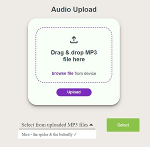
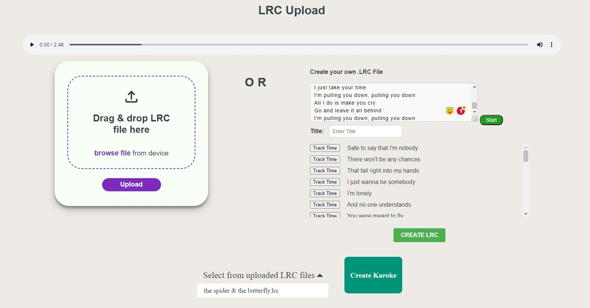
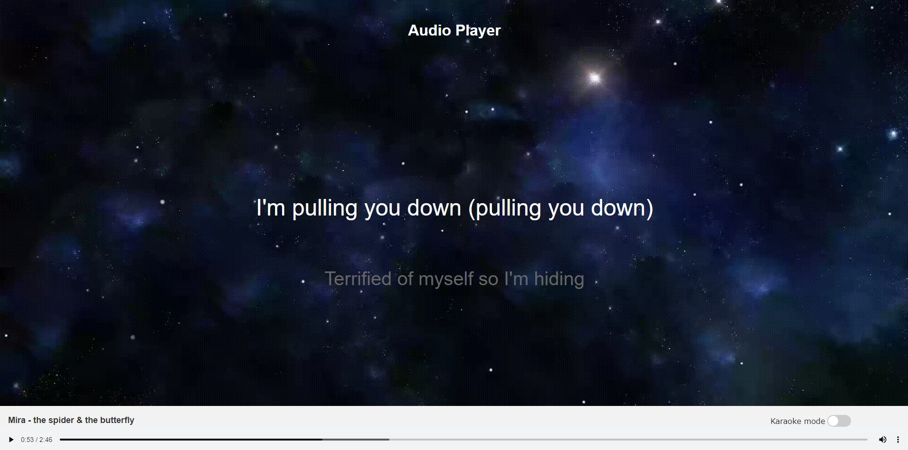

# KaraokeFusion

KaraokeFusion is a personal web project that allows users to create personalized karaoke videos by integrating user-uploaded .mp3 audio files with corresponding .lrc lyric files. The software also separates the vocal elements from the accompanying musical components, enabling users to relish a purely instrumental experience.

## Installation
Use the package manager [npm](https://docs.npmjs.com/) to install express and multer.
```bash
npm install express

npm install multer
```

Use the package manager [pip](https://pip.pypa.io/en/stable/) to install spleeter.

```bash
pip install spleeter
```
## Usage
To use KarokeFusion, start the server with the following command line in the terminal:
```bash
node server.js
```
Type localhost:3000 in your browser bar


Upload and select your mp3 file



Upload or create your own lrc file



Enjoy your self-produced karaoke video!



** 
Toggling the Karaoke mode mutes the vocal elements of the music, allowing you to sing with just the instrumentals.

## Contributing

Pull requests are welcome. For major changes, please open an issue first
to discuss what you would like to change.

## License

MIT License

Copyright (c) [2023] [Jeff Wong]

Permission is hereby granted, free of charge, to any person obtaining a copy
of this software and associated documentation files (KaraokeFusion), to deal
in the Software without restriction, including without limitation the rights
to use, copy, modify, merge, publish, distribute, sublicense, and/or sell
copies of the Software, and to permit persons to whom the Software is
furnished to do so, subject to the following conditions:

The above copyright notice and this permission notice shall be included in all
copies or substantial portions of the Software.

THE SOFTWARE IS PROVIDED "AS IS", WITHOUT WARRANTY OF ANY KIND, EXPRESS OR
IMPLIED, INCLUDING BUT NOT LIMITED TO THE WARRANTIES OF MERCHANTABILITY,
FITNESS FOR A PARTICULAR PURPOSE AND NONINFRINGEMENT. IN NO EVENT SHALL THE
AUTHORS OR COPYRIGHT HOLDERS BE LIABLE FOR ANY CLAIM, DAMAGES OR OTHER
LIABILITY, WHETHER IN AN ACTION OF CONTRACT, TORT OR OTHERWISE, ARISING FROM,
OUT OF OR IN CONNECTION WITH THE SOFTWARE OR THE USE OR OTHER DEALINGS IN THE
SOFTWARE.
